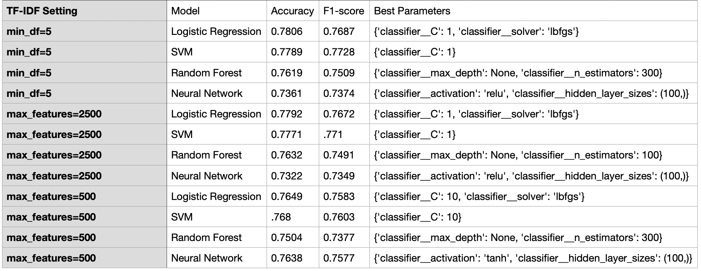

# Twitter Sentiment Analysis (NLP)

This project applies various machine learning classifiers to perform sentiment analysis on tweets related to major U.S. airlines. The goal is to classify each tweet as **positive**, **neutral**, or **negative** using text preprocessing, TF-IDF vectorization, and both baseline and tuned machine learning models.

---

## 📁 Dataset

- **Source**: [Twitter US Airline Sentiment Dataset](https://www.kaggle.com/crowdflower/twitter-airline-sentiment)
- **Size**: ~15,000 tweets
- **Features Used**: 
  - `text` — the content of each tweet  
  - `airline_sentiment` — sentiment label (positive, neutral, negative)

---

## 🛠️ Tools & Libraries

- Python 
- pandas, numpy, matplotlib 
- scikit-learn  
- NLTK  
- GridSearchCV  

---

## 📊 Project Structure

| Stage                          | Description                                      |
|-------------------------------|--------------------------------------------------|
| 🧹 Data Preprocessing          | Text cleaning, tokenization, stopword removal, lemmatization |
| 🔡 Text Vectorization          | TF-IDF with 3 different configurations:  `min_df=5`, `max_features=2500`, `max_features=500` |
| 🧠 Models (Baseline)           | Logistic Regression, SVM (Linear), Random Forest, MLP |
| 🔍 Hyperparameter Tuning       | GridSearchCV with 5-Fold CV on all classifiers |
| 📈 Evaluation Metrics          | Accuracy, F1-score, Fit Time (baseline only)    |
| 📁 Exported Results            | CSV files for both untuned and tuned model results |

---

## 🧪 Models Used

- Logistic Regression (Multinomial)
- Linear Support Vector Machine (SVM)
- Random Forest Classifier
- Feed-Forward Neural Network (MLP)

---

## 🧠 TF-IDF Settings Tested

| Setting             | Description                                  |
|---------------------|----------------------------------------------|
| `min_df=5`          | Only keeps terms that appear in ≥5 documents |
| `max_features=2500` | Keeps top 2500 terms by frequency            |
| `max_features=500`  | Keeps top 500 terms by frequency             |

---

## 🏁 Results Overview

### 🔹 Without Hyperparameter Tuning
- Models were trained and evaluated with default settings.
- Metrics: Accuracy, F1-score, Fit Time
  

### 🔹 With Hyperparameter Tuning (GridSearchCV)
- Best parameters were selected using 5-fold cross-validation.
- Metrics: Accuracy, F1-score, Best Parameters

---

## 📌 Key Insights

- **SVM** and **Logistic Regression** consistently outperformed other models across all TF-IDF settings.
- **MLP** neural networks showed significant improvement after tuning, especially for lower feature sizes (`max_features=500`).
- **Random Forest** was the slowest and underperformed compared to linear models.
- **TF-IDF vectorization settings** had a significant impact on model performance.
- **Hyperparameter tuning** clearly boosted F1-scores, particularly in smaller vocabularies.

---

## 📂 Files Included

| File Path                                   | Description                              |
|---------------------------------------------|------------------------------------------|
| `code/sentiment_analysis_nlp_twitter.py`    | Full pipeline for baseline evaluation    |
| `code/sentiment_analysis_tuning.py`         | GridSearchCV tuning script               |
| `results/sentiment_analysis_no_tuning.csv`  | Results of models without tuning         |
| `results/sentiment_analysis_with_tuning.csv`| Tuned model results and best parameters  |
| `data/preprocessed_airline_sentiment.csv`   | Cleaned and labeled dataset              |
| `images/sentiment_analysis_no_tuning.png`   | Image of models without tuning           |
| `images/sentiment_analysis_with_tuning.png` | Image of model results and best parameters  |

---

## 🚀 Future Improvements

- Try deep learning models like LSTM or BERT  
- Apply sentiment classification on multilingual tweets  
- Integrate model into a simple Flask web app for real-time predictions  

 
